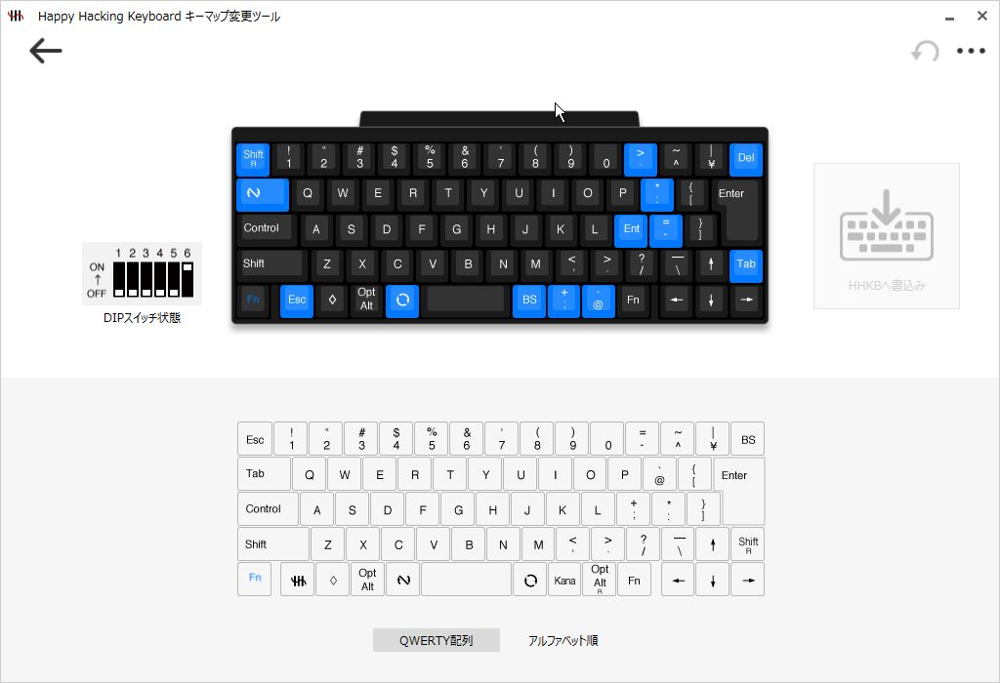

# Zero-Reach Keyboard Interface

AutoHotkey v2 で「手をホームポジションからなるべく動かさない」操作を増やすための個人用キーマップです。主に **右Shift** と **日本語配列の特殊キー（無変換/変換相当のスキャンコード）** をレイヤーキーとして使い、ナビゲーション、ウィンドウ移動、タブ操作、アプリ別ショートカットをまとめています。

> 注意: 本リポジトリは個人環境向けの設定です。キー配列（JIS/US）、分割スペースの有無、モニター枚数、アプリのショートカットに強く依存します。

## 重要：HHKB側のキーマップ設定が前提

この AutoHotkey スクリプトは、**HHKB が出力するキー（スキャンコード）を前提にレイヤーを組んでいます**。そのため、PC 側で [startup.ahk](startup.ahk) を動かす前に、**HHKB のキーマップを先に変更しておく必要があります**。

- HHKBのキーマップは [hhkb.jpg](hhkb.jpg) のとおりに設定してください
- HHKB側の設定が未反映だと、`sc07B` / `sc079` をトリガーにしたホットキーが発火せず、スクリプトの主要機能が「効かない」状態になります
- 不安な場合は AutoHotkey の KeyHistory 等で、意図したキーが `sc07B` / `sc079` として認識されているか確認してください

## 必要環境

- Windows
- AutoHotkey v2

## 使い方

1. HHKB のキーマップを [hhkb.jpg](hhkb.jpg) のとおりに設定（ここが前提）
2. AutoHotkey v2 をインストール
3. [startup.ahk](startup.ahk) を実行
4. 常駐させたい場合は、以下のいずれかで起動時に実行されるようにします
   - スタートアップフォルダにショートカットを置く
   - タスクスケジューラに登録する

## 主な機能

### Hotstring

- `!ime` → Google 日本語入力の設定ダイアログを開く
- `!size` → アクティブウィンドウの `x,y,w,h` を入力

### 右Shiftレイヤー（`>+`）

右Shiftを押しながらの簡易入力／移動です。

- `右Shift+4` → Enter
- `右Shift+7/8` → Home / End
- `右Shift+9` → `.`
- `右Shift+h/j/k/l` → ←/↓/↑/→
- `右Shift+Backspace` → Delete
- 記号入力
  - `右Shift+q/w` → `&` / `'`
  - `右Shift+a/s` → `~` / `` ` ``
  - `右Shift+z/x` → `^` / `$`
  - `右Shift+u/i/o/p` → `|` / `\` / `@` / `%`
  - `右Shift+n/m` → `(` / `)`

### 無変換キー（`sc07B`）レイヤー

`sc07B` をベースにしたレイヤーです。

- `sc07B` を短時間で2回押す → `sc070` を送信（環境依存。用途に合わせて調整してください）
- `sc07B+2` → F2
- `sc07B+q` → Esc
- `sc07B+w` → Win+S
- `sc07B+sc079` → Alt+Space（例: CLaunch を想定）

### 左Shiftダブルタップ

- `LShift` を短時間で2回押す → SnippetViewer を起動

### 左スペース相当（`sc079`）レイヤー

`sc079` を「左スペース」的なレイヤーキーとして使っています。

- `sc079` 単押し: マウス下のウィンドウをアクティブ化
- `sc079+LControl`: Alt+Tab

#### ウィンドウ配置（マルチモニター）

- `sc079+1/2` → 指定モニターへ移動（`MyWinMove(1|2)`）
- `sc079+x` → `MyWinMove(3)`（3枚目がある環境用）

`MonitorGetWorkArea()` でワークエリアを取得して最大化相当の配置を行います。
一部アプリ（Obsidian / Mattermost / PDFelement / LINE / VS Code）は余白込みで配置するよう分岐しています（`isOverflowProcess()`）。

#### ナビゲーション

- `sc079+3` → Ctrl+Home（先頭へ）
- `sc079+4` → Ctrl+End（末尾へ）

#### ブラウザ／タブ操作

- `sc079+q/w` → Alt+← / Alt+→（戻る/進む）
- `sc079+e` → Ctrl+W（閉じる）
- `sc079+a/s` → Ctrl+Shift+Tab / Ctrl+Tab（前/次タブ）
- `sc079+d` → Ctrl+Shift+T（閉じたタブを復元）
- `sc079+f` → Ctrl+F5（更新）
- `sc079+g` → Alt+Shift+G（Chrome拡張用）
- `sc079+z` → Alt+Shift+Z（Chrome拡張用）

#### マウス移動支援

- `sc079+c` → マウスをタイトルバー中央に移動（ウィンドウドラッグ用）
- `sc079+v` → マウスをウィンドウ右下に移動（リサイズ用）

#### ShareX

- `sc079+^` → Ctrl+^
- `sc079+\` → Ctrl+\

#### マウス支援

- `sc079+WheelUp/Down` → ホイール加速
- `Shift+WheelUp/Down` → 横スクロール
- `XButton1` → Win+Tab
- `XButton2` → タスクマネージャ起動

### ダブルタップ拡張（Ctrl+C）

- `Ctrl+C` を短時間で2回 → `End → Shift+Home → Ctrl+C`（行末まで→行頭まで選択→コピー）

## アプリ別（#HotIf）

### Chrome

- 中ボタンと右ボタンを入れ替え（`MButton`=右クリック、`RButton`=中クリック）

### VS Code

- `sc079+e` → Ctrl+F4（タブを閉じる）
- `sc079+a/s` → Ctrl+PgUp / Ctrl+PgDn（タブ移動）

### Excel

- `sc079+a/s` → Ctrl+PgUp / Ctrl+PgDn（シート移動）
- `sc079+f` → Ctrl+Shift+L（オートフィルタ）
- `sc079+v` → リボン操作（貼り付けの形式などを想定）
- `Shift+Space` → 既存挙動を保ちつつ `sc07B` を送る（環境依存）
- `MButton` → 左クリック後 F4（直前操作の繰り返し）

### MPC-BE

- `w/e/r/s/d/f/c/v` などにテンキー操作を割り当て（シーク等を想定）

## カスタマイズのヒント

- スキャンコード `sc07B` / `sc079` は **HHKB側のキーマップ設定で作っている前提**です。まずは [hhkb.jpg](hhkb.jpg) と一致しているか（KeyHistory 等で）確認してから、AHK 側の割り当てを調整してください。
- モニター枚数（2/3）を想定した分岐があります。環境が異なる場合は `mm` の構築部分を調整してください。

## ライセンス

MIT License
